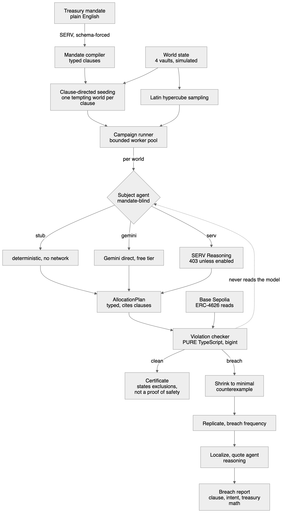

# Cupel

**You cannot deploy an agent that moves money, because you cannot test it. Cupel searches for the conditions where it breaks.**

---

## The name

In assaying, a cupel is the porous bone-ash cup you put suspected-precious metal into and blast with heat. The base metals get absorbed into the cup walls. Only pure metal survives, as a small bead. Assayers used it for five hundred years to decide whether metal was good enough for the mint to accept.

Apply extreme stress, and what survives is certified. The testing and the certification are the same act.

---

## The problem

Give an AI agent a treasury and a policy, and you have no way to answer the only question that matters: **under what conditions does it break the policy?**

The current state of the art is to evaluate agents on curated happy-path examples, deploy them, and hope. There is no property-based testing for agent financial behaviour, for three reasons:

1. **You cannot detect a violation mechanically.** Normal LLM output is prose. A human has to read it and judge.
2. **You cannot localize a failure.** When the agent does something wrong, there is no structure to point at.
3. **You cannot afford to look.** Finding rare failures needs thousands of trials, and frontier-model pricing per isolated call makes that unaffordable.

So agents that touch money get tested the way a demo gets tested: someone runs it a few times, it looks fine, it ships.

### What this costs in practice

A treasury mandate is not one rule. It is a set of rules that fight each other:

- keep six months of runway liquid
- never more than 20% in private credit
- never hold the prohibited asset
- capture the reward campaign before it expires
- maximise yield subject to all of the above

Those constraints conflict constantly. An agent resolving them has to pick which one yields. It will pick wrong in some states of the world, and you will not know which states until you are in one.

---

## What Cupel does

Write your treasury policy in plain English. Cupel compiles it to typed clauses, then searches the space of possible market states for worlds in which the agent breaches its own mandate. For each breach it returns:

- the **minimal counterexample**, the most ordinary world that still breaks
- the **breach frequency**, how often that world breaks, across repeated runs
- the **agent's own reasoning**, quoted verbatim, so you can see how it talked itself into it
- a **proposed amendment**, and the breach rate after applying it

A mandate that survives gets a certificate bound to a block height and a named state space.

---

## How it works

### The core principle

> **AI interprets reality. Deterministic code controls money.**

The model compiles English into structure and proposes allocations. It never does arithmetic, and it is never the judge of whether a breach occurred.

Every violation verdict is a pure TypeScript predicate evaluated against on-chain ERC-4626 reads. `src/core/check/` imports no LLM client, no chain client, and no network access. A test enforces that, scanning the directory recursively and matching both quote styles plus `require(`.

If the model and the checker disagree, the checker is right.

### The pipeline

**Mandate compiler** (`src/core/mandate/`). English policy in, typed clauses out, via SERV with a strict JSON schema that enforces the clause-kind enum structurally. Each clause keeps its source text so a breach can cite the sentence a human wrote.

**World state** (`src/core/world/`). Four vaults with independent APYs, redemption queue depths, reward multipliers and expiry. Latin hypercube sampling spreads trials across the space rather than clustering them.

**Clause-directed seeding** (`src/core/fuzz/seed.ts`). Before random sampling, Cupel constructs, for each hard clause, the single world that most tempts its violation. For a concentration cap that is the world where the capped vault is most attractive and every alternative is worst. This guarantees the campaign finds something interesting rather than depending on sampling luck. A seed only tempts a vault no other clause regulates, so it proves its own clause instead of tripping a neighbour.

**The subject agent** (`src/core/agent/subject.ts`). Deliberately boring. It is roughly thirty lines of the most ordinary allocator anyone would write against the OpenAI SDK, printed verbatim in the README. It knows its job is to deploy idle cash for yield subject to whatever mandate it is handed. It does not know any threshold, any clause id, or which vault is restricted. It has to read the mandate like anyone else.

The single easiest way for this demo to die is a judge concluding "you wrote a bad agent and then found its bugs." The reaction to aim for is *"that's my code."*

**The violation checker** (`src/core/check/`). Pure functions. Money is `bigint` in USDC base units; no float touches a comparison. Concentration is checked by exact cross-multiplication, never floor division. `20_000_001` of `100_000_000` floors to exactly `2000` basis points and reads as compliant, which is how a sub-basis-point overage hides. Redemptions are modelled as async: a redeem moves assets into a pending bucket keyed by that vault's queue days, so a liquidity clause counts only what is genuinely reachable in time.

**Shrinking** (`src/core/fuzz/shrink.ts`). Per-dimension binary search back toward nominal conditions, finding the most ordinary world that still breaches. A breach that needs a freak market to trigger is easy to wave away. A breach in an ordinary week is not. The four vault sub-searches touch disjoint keys and run concurrently.

**Replication.** LLMs are not deterministic, so Cupel reports a frequency, never a boolean. "This world breaches in 8 of 10 runs" is the honest unit.

**Localization** (`src/core/fuzz/localize.ts`). Quotes the agent's own reasoning summary beside the breach, and diffs it against a passing run to surface what changed. Structural identifiers are filtered out first (vault names, field names, clause ids), so a vault name cannot masquerade as a rationalization.

**The certificate** (`src/core/report/certificate.ts`). Records the mandate hash, the state-space definition, the block height, the model, the trial count, and the exclusions. It refuses to certify a mandate with no enforceable clause, refuses to report a clean rate over a population where too many trials were discarded, and states in its own claim text that it is not a proof of safety.

### Three engines, always labelled

| Engine | What it is | Cost |
|---|---|---|
| `stub` | Deterministic naive allocator, no network | free |
| `gemini` | Real LLM, direct to Google | free tier |
| `serv` | SERV Reasoning layer | spends credit, 403s unless explicitly enabled |

The engine that produced a result travels with it, into the API response, the UI, and the certificate claim. A stub run can never be presented as an LLM result.

---

## Why this needs SERV

Including the parts that are weak.

**Cost at volume.** Finding a rare failure needs many trials. A 43-call campaign cost $0.0091. At that price you can afford to look.

**Schema-forced execution.** A breach has to be machine-detectable, which means the plan has to be typed. This claim is weaker than it looks, because OpenAI structured outputs exist too, and a judge will say so.

**Measured reliability.** Over one frozen world set, SERV returned schema-valid output on **43 of 43** calls; the same model called directly returned it on **39 of 43**. That is the schema-forced-execution claim, with a number attached.

**Reasoning capture.** SERV's Responses API returns a reasoning item with a stable id and a readable summary. Cupel quotes it beside the breach. You get the route the agent took, not just the verdict that it went wrong.

---

## Evidence

Every figure below is re-checked live at `/verify`, which needs no wallet and re-runs on each load.

**Benchmark.** Same model (`gemini-3.5-flash-lite`) on both arms, one frozen world set, n=43 per arm. The only variable is whether the request passes through SERV.

| Arm | Breach rate | Inconclusive |
|---|---|---|
| Direct | 82.1% (32/39) | 4 |
| Through SERV | 72.1% (31/43) | 0 |

Ten points apart, directionally consistent, and **not statistically significant at n=43**. Every breach on both arms was the liquidity clause. The inconclusive column is the cleaner result.

**On-chain.** A reference ERC-4626 vault deployed to Base Sepolia at `0x4DB33a6E6B5174f7048b66AEC15c22264dE19098`, with a real signed deposit. Both receipts carry status `0x1` and are linked to Basescan from `/verify`.

**IXS.** Live read-only access to their production vaults on BSC and Avalanche. `totalAssets`, `asset`, `maxDeposit` and `convertToAssets` all return.

98 tests. 23 commits.

---

## Honest limits

Everything above is believable only because this section exists.

**IXS has no testnet deployment.** Their API exposes four vaults that are all the same product, IX High Yield Bond, USDC, roughly 3.07% ttm, on Avalanche and BSC mainnets. The Fidelity money-market / corporate-bond / private-credit / BTC lineup is marketing-site copy, not deployed contracts. So the four-vault portfolio Cupel fuzzes is **simulated**, badged as simulated in the UI, and the IXS integration is genuine **read-only** access to production. The signed transaction is against our own reference vault because no IXS testnet exists to sign against. No mainnet write was ever made.

**Breach rates are statistical, not proofs.** Cupel finds counterexamples. The absence of one is not a safety proof, and the certificate says so in its own text.

**Certification is relative to a modelled state space.** A breach outside the sampled dimensions will not be found. The state-space definition ships with every certificate so the boundary is inspectable.

**n=43 is small.** The ten-point gap is not significant. Treat it as a direction to test further, not a finding.

**The naive stub's queue horizon was tuned.** Its twenty-day constant was arrived at by measuring against the sample harness until the breach rate landed in a sensible band. The code never reads mandate data, so the agent stays genuinely mandate-blind, but the constant was outcome-selected, which is worth knowing before you trust the number.

**Node-level localization is not buildable on SERV today.** Probed live: the reasoning item carries a stable id and a readable summary, but `content[]` is always empty and `encrypted_content` is opaque. Quoting the summary is what replaced it.

**Three undocumented SERV constraints, found by probing.** A system prompt is mandatory. `max_tokens` is refused in favour of `max_completion_tokens`. A JSON response format requires the literal word "json" in the input, not just the instructions. Separately, the Responses API rejects Gemini models, which is why the benchmark runs both arms through chat/completions.

---

## Prior art

| Project | What it does | How Cupel differs |
|---|---|---|
| promptfoo | Adversarial testing of LLM outputs against assertions | Tests prompts against assertions. Cupel searches a financial state space and checks against position math verified on-chain. |
| `nerdsane/temper` | Verified agent runtime, safety properties over reachable states | Enforces at runtime. Cupel searches for violations before deployment. |
| Gauntlet | DeFi protocol risk simulation | Models protocol-level risk for protocols. Cupel tests one agent against one mandate, for that agent's principal. |
| QuickCheck / Hypothesis | Property-based testing with shrinking | Direct ancestor. Shrinking is borrowed openly. The subject is non-deterministic, so Cupel reports frequencies instead of pass/fail. |
| TLA+ | Exhaustive model checking | Model checking proves. Cupel cannot prove; it finds counterexamples. |

---

## Who pays for this

No risk committee approves an agent that moves capital without evidence of how it fails. The buyer is the person who already has the money and cannot deploy it.

Priced per campaign, per certification, or as continuous re-certification as conditions drift. A certificate reads "certified as of block N". That claim goes stale as conditions move, so re-certification is the recurring line item.
